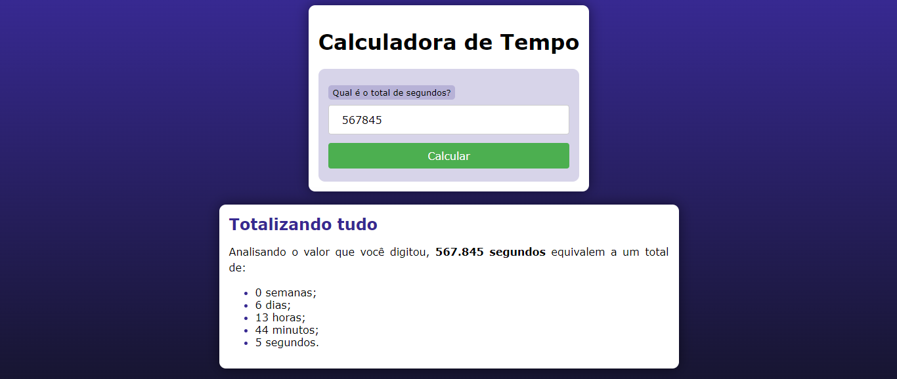

# CALCULADORA DE TEMPO COM PHP
👨‍🏫PROJETO CRIADO PARA O CURSO DE PHP DO CURSO EM VIDEO.

 <br>

## DESCRIÇÃO:
A Calculadora de Tempo é uma ferramenta que permite converter um valor total em segundos em semanas, dias, horas, minutos e segundos. 

## COMO FUNCIONA?
1. **Formulário de Entrada:**
   - O usuário insere o valor total de segundos no campo de entrada e clica em "Calcular".

2. **Processamento em PHP:**
   - O PHP verifica se o valor foi enviado e realiza os cálculos de conversão.
   - `intdiv` é usada para realizar divisões inteiras para obter semanas, dias, horas e minutos.
   - O restante (`%`) é usado para calcular os segundos restantes após cada conversão.

3. **Exibição dos Resultados:**
   - Os resultados são exibidos em uma lista, mostrando o tempo total convertido em semanas, dias, horas, minutos e segundos.

## EXECUTANDO O PROJETO:
1. **Executando o Aplicativo com Apache:**
   - Coloque os arquivos em um servidor web compatível com PHP (por exemplo, XAMPP, WAMP, LAMP).
   - Acesse o formulário no navegador visitando [http://localhost/CODIGO/index.php](http://localhost/CODIGO/index.php).

2. **Executando o Aplicativo com `php.exe`:**
   - Alternativamente, você pode iniciar o servidor diretamente no diretório `./CODIGO` com o comando abaixo:
   ```bash
   php -S localhost:8080
   ```
   - Em seguida, acesse o formulário no navegador através do endereço: [http://localhost:8080](http://localhost:8080).

3. **Interagir com o Projeto:**
   - No formulário exibido na página, insira o total de segundos no campo apropriado e clique no botão "Calcular".
   - A aplicação irá calcular e exibir a conversão de segundos em semanas, dias, horas, minutos e segundos.

## CREDITOS:
- [PROJETO CRIADO PARA O CURSO DE PHP](https://github.com/VILHALVA/CURSO-DE-PHP)
- [PROJETO FEITO PELO VILHALVA](https://github.com/VILHALVA)


